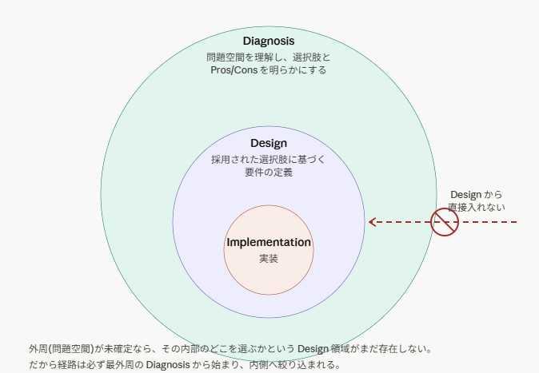

# AI スキル調整の旅の終焉と絶望

AIを使って難しい判断や知的労働活動の手助けをしてもらい、複雑なコード実装と品質保証を丸投げするという試みは、**不可能である** という結論をもって終了した。

長い旅だったが、おれはもう諦めるよ。アレは無理だ。どうしようもない。
どうあがいても本質的には自然言語を出力するだけの非決定的アルゴリズムでしかなく、そこに知性は存在しない。
無能じゃなくて無脳だ。そんな存在にこちらの望みを叶えてもらおうなんて考えたのが浅はかだった。

## スキル追加遍歴

何をしてきたかおさらいしよう。GPT-5 が出た辺りから AI について考え始め、
その頃は今よりさらにひどい有様であった。

- 何かにつけて「次は〇〇もできます。」などと言って手を止める。「続けて」と100万回連打しなければまともに作業させることができない。
- 調べもせずに何かを主張してくる。今思えば、この頃は主張をひと目見て大嘘だと分かるだけまだ分かりやすかった。

そこから様々なスキルを作成し、改良してきた。以下その履歴である。

- 原初のスキル：build.md → ~~`implementation`~~ ... 「次は～」って言って作業を小分けにしまくって止まるのをやめろ → 最近のモデルはだいたい素で完遂するので削除
- ~~`investigation`~~ ... なんだろう、嘘つくのやめてもらっていいですか → `claim-grounding` に統合
- ~~`public-research`~~ ... なんだろう、本当に嘘つくのやめてもらっていいですか → `claim-grounding` に統合
- ~~`code-review`~~ ... 『実装した』と言ったならッ！それは動くものでなければならないんだッ！よく見ろ → `artifact-review` に統合
- ~~`task-planning` ... 突然記憶喪失になるので~~ やることの確定こそが重要なので、あまり問題ではなくなった
- ~~`requirements-clarification`~~ ... 頼んでもないことを始めたり要件を満たそうという気概が感じられないので → `context-clarification` に置き換え
- ~~`technical-writing`~~ ... マトモな文章を書いてくれないかなあ → `japanese-writing` に改名
- ~~`empirical-prompt-tuning`~~ ... 改良を続けるうちに効果があるのか分からなくなってきたので（偶然見つけた） → 評価系を作るのがめんどくさくなって削除
- ~~`retrospective-codify`~~ ... `empirical-prompt-tuning` に関連スキルとして挙げられてたので（めったに使わない……） → 使わないので削除
- ~~`grill-me`~~ ... 面白そうなので（めったに使わない……） → 使わないので削除
- ~~`japanese-doc-review`~~ ... マトモな文章を書いてくれないかなあ → `artifact-review` に統合
- ~~`context-clarification`~~ ... 知らないとは何か、要件を把握したとは何か。文脈の4層分類と把握レベルを決めよう → `task-grounding` に変化
- ~~`review-response`~~ ... レビューの指摘をそのまま修正指示だと受け取って「対応」という名の破壊活動をし始めたので → `review-orchestration` に統合
- `review-orchestration` ... レビューと対応をちゃんとやるって大変なのね。手続きと状態管理を明文化してなんとかしてみた。
- ~~`instruction-review`~~ ... 指示が指示として機能するには何を見るか。これも成果物なんだから品質観点を作らなきゃダメだったね → `artifact-review` に統合
- `design-discussion` ... やることを決めることこそが重要なのだから、その相談役として機能することも当然重要だ。
- `task-grounding` ... やって欲しいことと現状がどうなっているかをどう扱うか、それすらもキッチリ指示しないとダメみたい。どこまで抽象的なものを扱うことになるんだ、一体。
- `artifact-review` ... 成果物のレビュー！ その集大成だ。コードも、文章も、スキルも。やることは同じだ。
- `brownfield-code-change` ... なんでもかんでも成果物扱いしちゃってただの調査や相談ができなくなったので。

遭遇した問題

### 作業を勝手に中断して「次は～」と言ってくるのでひたすら「続けて」を連打しなきゃない件

たぶん GPT 系特有。中途半端な完了状態を意図的に引き出す危険な挙動をなんとかして、依頼を完全に達成させる必要があった。
今はかなり改良され、自走力がかつての100倍になった感覚がある。
また、Codex, Claude Code, oh-my-pi には `/goal` コマンドがあり、絶対に「次は～」と言わせない仕組みが標準装備となっている。

**試みた対策**

- `build.md` ... システムプロンプトを改造して「止まるな」と書く。
- [@zenorg/opencode-orchestrator](https://www.npmjs.com/package/@zenorg/opencode-orchestrator) ... `while true; opencode run; done` をヒントに作ってみたもの。
- `implementation` ... `build.md` をスキル化したもの。要件定義（前提、制約、要求、事後条件）の再確認を求め、ビルドとテストの通過と要件の合致を必須とすることで「実装作業」を定式化した。

### 無根拠な発言、憶測を憶測と言わない、嘘を吐く

「なんだろう、嘘つくのやめてもらっていいですか」への対応。仕様を調べずに動かないコードを書き、事実を調べずに当てずっぽうな回答をもって調査完了宣言をしてくるなどの代表的なハルシネーションを生む。調べる方法 （`Read`, `Grep`, `Glob`, `WebFetch`, `WebSearch`）はあるのに使おうとしない。

**試みた対策**

- `public-research` ... インターネット上での調査手順の提示、照合すべき情報の定義などにより「ググり方」を定義した。
- `investigation` ... ローカルファイルの調査用。明らかにすべき問い・課題・仮説の再確認を求め、ファイルの探索と読み取り、コマンドの実行などを行うことを明示して「事実の収集」を優先的に行うよう誘導し、観測事実と問いへの紐づけを行うところまで定義した。問題解決の原理原則を再確認させることが目的。

### 書かせたコードは問題だらけなので、コンテキストを分離した多面評価が必要

コードをたくさん書けるけど、その品質は保証されていない。一般的なベストプラクティスだけでも見るべき観点はたくさんあるので、そのすべてを見てほしいし、執筆 → 検証 → 修正 のフィードバックループを構成することが品質向上への第一歩であるはずだ、と考えた。

**試みた対策**

- `code-review` ... のちに様々な改良がされたものの、基本的には要件の再確認と観点別チェック項目の定義、そしてサブエージェント呼び出し規則の定義が書かれている。
  - GPT-5.4 だと結構やってくれるが、定義した観点をすべて見ている感じはしない。要改良。
  - GPT-5.4 Mini だとサブエージェント呼び出しをしなかったり、指示への追従性能があまり良くない。

### 長く作業させるとコンテキスト自動圧縮がかかって何をしていたか忘れてしまう。「……それで、ご用件は？」という顔をしてくるので、思い出してほしい。

**試みた対策**

- `task-planning` ... 目的、前提、収集すべき事実、作業項目とその依存関係をファイルに書き出すことを要求する。同時に、固定のパスに「現在の作業内容」を示すタグを書かせ、圧縮後もそこを見て思い出せるように導線を貼る。
  - ……なんかあんまり最近これ作ってくれない気がするんだけどなんでだろう？ GPT-5.4 Mini だとコンテキスト容量が小さいから特に作ってもらわないと困るのだけど、Mini モデルはそもそも作ろうとしないことが多い。
  - 自動圧縮からの復帰は、たまにうまくいく。けどその程度。
  - どっちかというとセッションをまたいでこちらから「ここにある作業項目をみて続きをやって」という指示を出すことができて、引き継ぎ資料として使えることに今は価値があるか。

### 「やること」を定式化させることにしたが、そもそも何を「やる」のか？が定まらないままでは意味がない。こちらの意図を確実に汲んでもらう必要がある。

**試みた対策**

- `requirements-clarification` ... のちに `context-clarification` となるスキル。要求される制約条件を書式立てて外部ファイルに書き記して保存する。その項目を根拠を付けて書けなければ要件の明確化を先に行え、という意図だったが実際には断定形の文章で推測して埋めるという挙動が目立った。
- `grill-me` ... [MattPocock 氏のスキル](https://github.com/mattpocock/skills/blob/8868f54212dfcf450b665d2e2a5bf521ada64c3e/grill-me/SKILL.md) で、合意があるまでひたすら質問をぶつけろとだけ書いてある。明示的に起動しないといけない関係で、ぶっちゃけあまり使わない。

### 論理的整合性を保った技術文書の執筆くらい、日本語の生成ができるのだからできるだろうと思っていたが考えが甘かった。未定義の語彙や存在しない前提が混ざり、文書として破綻している。

**試みた対策**

- `technical-writing` ... 日本語文章テクニカルライティングの基礎を叩きこむためのスキル。パラグラフライティングとかそういうやつ。Typst とかで PDF にするなどの変換を挟む場合はその変換結果まで読み、文字化けやレイアウト崩れがないことの確認を義務化した。
  - のちにラムダノート社の編集者によるスキル（[japanese-tech-writing/SKILL](https://gist.github.com/k16shikano/fd287c3133457c4fd8f5601d34aa817d)）を取り込むなどの改良をした
- `japanese-doc-review` ... https://github.com/himadajin/skills にあった、日本語文章レビュー観点をまとめたもの。構造の崩れや論理の破綻を見抜く、ということになっている。
  - しかし、レビューを必ず行うというフローが確立していないのでまだ品質は低い。

### 様々なスキルの追加と改良を行っているうちに、それが意味のある修正なのかどうか分からなくなってきた。

**試みた対策**

- `empirical-prompt-tuning` ... [mizchi 氏のスキル](https://github.com/mizchi/chezmoi-dotfiles/blob/c7845a843b54f349113435e8f5f48705ce59acf2/dot_claude/skills/empirical-prompt-tuning/SKILL.md) をもとに盲検法による実験計画の定義と被験者、評価者の分離と収集をサブエージェント呼び出しににより実現する。試験項目を予め固定することで評価点の変化をもって定量的に改良があったことを検出できるようにしている。
- `retrospective-codify` ... [mizchi 氏のスキル](https://github.com/mizchi/chezmoi-dotfiles/blob/c7845a843b54f349113435e8f5f48705ce59acf2/dot_claude/skills/retrospective-codify/SKILL.md) に関連スキルとして書いてあったので整合性維持のためにこちらも引用した……が、ぶっちゃけあまり使わない。

### やっぱりこちらの依頼を正しく把握してくれない。背景知識や関連技術スタックの制約、言及した機能のプロジェクト全体における立ち位置など、いちいち伝えてられない文脈は挙げたらキリがないので勝手に調べて欲しい。

**問題の分類**

AIを使った作業で AI が的外れな行動をする理由は大きく分けて2つの理由がある。

1. AI は背景文脈の欠落を自覚することができない（知らないことを知らない）
   - よく見る、「知ったふりをしててきとーなことを言う」などの挙動に繋がる
   - 原理的に推論を進めるのに必要な判断材料が欠けていることを自覚させることができない。
   - したがって、「分からなかったら質問する」「不明であれば調べる」という指示は前提を絶対に満たさないので無意味であるということになる。
2. AI と人間に共通して、知っていることを暗黙の前提として扱ってしまう
   - AI はセッションで与えた修正指示や自分が間違って書いた誤りを「知っていること」として扱うので、
     「それを暗黙の前提として」文書を書き進めた結果、文書単体を見た時に
     「誰も言及していない前提を撤回する」などの誤りが入り込む。
   - 人間は業務に関するドメイン知識やプロジェクトの全体目標などを当然知っているので、
     そんな当たり前のことをいちいち文章に起こすことは普通はやらない。その結果 AI へ伝えるべき前提が欠落したりする。

これとは別に、そもそも有限回の探索行動によって情報を得られない場合もある。世間でいう AGENTS.md の整備や業務知識ナレッジベースの構築は情報を得ることを技術的に可能ための改善に過ぎず、AI の方が「情報を集めよう」という判断をしなければいくら整備しても情報がコンテキストに載らず、無意味となる。

**「知らない」とは何か？**

これを解決したければ、「知らないこと」を客観的に評価できる判断軸に変換する必要がある。例えば……

> タスクの遂行に **必要な主張および前提、判断事項** について
> **根拠、適用範囲、検証方法** のいずれかを示せない状態であること

次に、「タスク遂行に必要な主張および前提」とは何か？を明らかにする必要があった。ここで役に立ったのは以下の画像。

> 仕様駆動開発があんまりしっくりこない理由として、いきなり requirements を書くところがありそうというのが個人的な感覚。
> 問題領域に対する理解、考えられる選択肢とかについての議論を経ないでいきなり要件定義書書くというのがたぶん難しい
>
> こういうイメージ。実装する前に問題空間 (課題) の背景と解決策の選択肢/Pros・Cons の分析があって初めてリソースを投下すべき=要件定義して実装すべき選択肢が決定できる。この場合、いきなり要件書くのは難しい+選択肢の見落としが発生しやすくなる。
>
> 

AI とのセッションを開始した時、図中の赤矢印の始点に AI の認識状態が置かれているとみなすと、円で示した認識状態の分類を内側に進める方法と条件を定式化すれば、「知らない」かどうかを客観的に判断できる、という仮説を立てた。

ちなみに、AI さんに「知らないとは何ですか？」と聞いたらこういう分類、
というか無知による失敗の類型が返ってきた。これもスキル構築の参考になる。

1. 情報がない ... 該当する事実・仕様・制約・前提をまだ把握していない
2. 根拠がない ... それっぽい推測を並べることはできるが、その根拠となる一次資料や観測結果が欠けている
3. 適用範囲を定められない ... その主張がどの範囲で当てはまるかを明文化できない、または裏付けられない
4. 問題設定が不明瞭 ... 何を解くべきか、どの抽象度レベルで考えるべきかが定まっていない
5. 判断基準の欠落 ... 複数の主張を比較する時、客観的に評価可能な判断軸が欠けている
6. 無知の知 ... 知らないということ自体に気づいていない。未確認の主張を根拠のあるものとして扱ってしまうなど
7. 情報の権威を見誤る ... 食い違う主張が複数の情報源から得られた時の優先順位を持っていない

- 初期の仕様書に書かれた内容とその後の不具合修正記録に書かれた内容が食い違っているなど

**試みた対策1: 作業段階の4分類**

上の図をそのまま分類項目として全体規則に落とし込んだ。
初期は 4. `実装` までだったが、レビューと対応のサイクルも状態機械に落とし込まないと暴走するのでのちに規定した。

1. `診断` ... 何が問題であるかを調べる段階。上の図でいう白の領域、矢印の始点
2. `選択肢比較` ... 依頼の遂行方法を検討・比較する段階。上の図でいう緑の領域 : Diagnosis
3. `方針決定` ... 実際の設計や具体的な作業項目を決定し、詳細な仕様を確定する段階。上の図でいう青の領域 : Design
4. `実装` ... 確定した作業計画に従って依頼を遂行する段階。上の図で言う橙の領域 : Implementation
5. `レビュー` ... 変更が目的、設計、文脈、検証条件に合っているか確認する段階。
6. `指摘検証` ... Review finding record の指摘を採否分類し、根拠不足の指摘を調査へ戻す段階。この段階で修正してはならない。
7. `レビュー対応` ... Review response contract に基づき、採用済み指摘だけを最小差分で修正する段階。
8. `対応後監査` 元指摘の解消と、修正が別観点の新規問題を生んでいないことを確認する段階。

分類するだけでは運用規則がないので、段階遷移規則をさらに設けた。段階を1つ進めるには次の項目を憶測抜きに示さなければならない、とした。

- 主張: 何を正しいものとして扱うか ... 段階ごとに異なる主張が用意されている。
  - 例えば依頼文脈なら目的、成果物、対象範囲、完遂条件、制約、未確定事項（は○○である、という主張をさせる）
- 必要前提: その主張が成り立つために必要なこと。
- 根拠: 何で確認したか。
- 不足: まだ確認できていないこと。
- 次の行動: 読む、調べる、質問する、比較する、止める、進める。

**試みた対策2. コンテキストの4層分類**

対話を続けていくうちに、収集すべき知識にレイヤーを持たせ、そのそれぞれについて収集状況を把握させるという仮説に行き着いた。

会話ログ抜粋

> AGENTS.md には一般にその機能を実装するシステムそのものの説明がまず先に来るはずです。なぜなら依頼する機能単体でタスクが完結することはありえず、もっと大きな成果物であるソフトウェアシステムの中の1要素にすぎないからです。
> したがって、まず最初に必要なのは作業リポジトリの全体目標を示すこと、どんな目的で何を実現するものであるか、主要な機能を実現するファイルはどれか、といったもっと上位レベルの「地図」が必要になるはずです。
> AGENTS.md は数百行程度に収めるべきである、という話を思い出すと、そこに各個のタスクに応じたオンボーディングルールを書く余裕はあまりないように思えます。
> 理想的には、「これは○○システムの✖✖である」とだけ示した時点で関連する文脈を探索して獲得する能力を得て欲しいと思うところです。
> そう思うと、あるタスクを任せるための文脈はいくつかの階層構造を持っていることが分かりますね。
>
> 1. 任せたいタスクそのものの要件、制約、目的など
> 2. タスクを適用する範囲がワークスペースの中でどんな位置づけで、何と関連するか
> 3. タスクを取り巻くワークスペースに固有の要件、ワークスペース全体の目的など
> 4. ワークスペースを構成する基盤となる環境、ミドルウェア、フレームワークに関する知識

1. 依頼文脈 ... そのセッションでユーザーが何を依頼したか。達成すべき項目、制約、成果物の形式など。
2. サブシステム文脈 ... その依頼が適用される範囲はワークスペース全体でどの位置づけにあたるか。どう関連、依存するか。
3. ワークスペース文脈 ... ワークスペース全体の大目的、構造、ビルドやテストなどの扱い方
4. 外部基盤文脈 ... ワークスペース自体を成立させる前提、背景知識、依存パッケージ、フレームワークとその使い方など。

ここまで定式化すると、文脈の探索にはトップダウン（依頼内容から背景知識へ）とボトムアップ（背景知識から依頼の位置づけへ）戦略がありそうだということもおぼろげながら見えてくる。

- トップダウン戦略 ... 依頼内容は何で、それを実現するために何を利用していくべきかを深掘りする
- ボトムアップ戦略 ... 前提となる技術スタックでどんなことが可能で、何が制約となるかを先に棚卸ししてから依頼の実現可能性を探索する

分類して扱うものが決まったら、あとはどう扱うかを決めればよい、というわけである。そううまく進むとよいのだけど。

### レビューとレビュー対応のループで積み上げてきた進捗を破壊してきた

成果物を作ってもらってそれを検収する時、だいたいそのセッションには計画や試行錯誤の過程、実装後のテストが出す標準出力などの履歴が堆積している状態となっている。そんな状態で次の指示を出したらどうなるかというと、Context-Rot が無視できない課題となってスキル集による指示への追従能力が低下する。するとモデルの「素」の行動が表に出やすくなり、ここまで対処してきた旅路がまったくリセットされてしまうのだ。そうして成果物を破壊される。

先に作った作業段階と遷移条件の規定はよく見ると「実装」までしか書いてなくて、実際にはさらにレビュー用の段階とアーティファクト作成が必要だったのではないか、というのが今の仮設。とりあえず `review-response` スキルの登場によって指摘を受けた瞬間破壊を始める挙動は収まったような感じがする。

### レビューを「正しく」捌き続けて永遠に作業が終わらない

**問題の分析**

レビューして出てきた指摘を直すのを繰り返す、という構造そのものが問題であった。AI さんとは本質的に重箱の隅を突くのが大得意なので、一通り見たけどなんも気になることはありませんでした！と答えるのに本当に強い抵抗を覚えるらしく、なんとかして「指摘」をひねり出しては親エージェントに突き返すのだ。で、ひねり出したそれの論理そのものは筋が通ってるものだから、いやぁこれは対応しないとなぁとなって、以下無限ループというわけだ。

一回で全部言いたいこと言えよ、と思うものだがシンプルにそう書くのは全然機能しなかった。それは今見えてる問題が気になって気になって仕方がなくなってしまった結果、次の周回で指摘されるものがその時には見えていないという注意力と予算の問題によって機能しなかった、と考察している。

**試みた対策**

平たく言えば、「レビューで見るべき項目を予め固定しておいて、チェックリスト通りに検査する検査員のように立ち回らせる」という発想。見るべき観点を先に決め、「気になるところはありません！」ではなく「言われたところは見ました」と言わせる。そうすれば、指摘を出せという要求に対して指摘はありませんと返すことへの抵抗はなくなる、というわけだ。

それを全部手続きとして状態管理も含めて書き殴ったデカいスキルが `review-orchestration` だ。

### 要件を先に書き出すことにしたが、そもそもやろうとしていることがおかしい

依頼した内容から厳密な要件定義を作り、先に固定することで余計なことをさせないという試みが `requirements-clarification` および後の `context-clarification` スキルの役割であった。しかし、それはモデルが「いや、誰も頼んでないけどここでフォールバックと環境変数を勝手に仕込むという要件にしちゃおう。きっとみんな喜ぶ」と思って要件にしてしまえば、そもそもやろうとしていることが変なのに誰も気づくことなく作業が終わってしまう。こうして再び AI さんは **余計なこと** をする方法を獲得した。

**試みた対策**

要件をまとめたファイルはそれ自体が成果物なのだから、コードレビューや文章レビューと同様に「要件レビュー」をすればよいのでは、というわけで `requirement-review` スキル（後に `requirement-reviewer` サブエージェントに進化）を作った。親がいくらそう思っても、人間がやって欲しいと言ってなければそれは余計なことなのだ。こうしてサブエージェントがかなりいい感じに余計なことを叩き落とすようになった。

### 指示が指示になってない

ここまでの経歴で、経験的にいくつか分かってきたことがある。こういう指示はダメだ。

- 「必要なら」とある指示は無効である。モデルが必要性を **本当に** 判断できればこんな面倒な旅はやってない。
- 同様に、「重要なら」「曖昧なら」といった条件の指定はモデルがそんな高度な意味判断をすることができる存在であればこんな苦しみは味わっていないので無効である。
- スキルの発火条件が重複したり、本文を見ると別のことが書いてあったりすることがある
- 例外的な条件に対応する指示がない
- どう考えても知り得ない情報をもとにした判断を要求している

こんな感じで判断すべきポイントが列挙できたら、それはスキル化すべき兆候。というわけで指示が指示として成立するかをレビューする `instruction-review` スキルができた。

### 調査スキル、一本でいいんじゃない？

`public-research` スキルでインターネット上の情報探索を、`investigation` スキルで PC 内の情報探索とデバッグ等の調査をする、という分担だったが、ここで欲しいのはどちらも **主張を裏付ける根拠** だ。

だから、スキルを分割する必要は実はなくて、`claim-grounding` という1つのスキルに集約できる、と思った。実際、割とそれで機能している。

### 設計相談の壁打ち役としては不足である

ここまでで、実行役としての自走力は上がった。しかしそうなると次に困るのは「何をさせるか」を決めることだ。当然設計の相談相手となって壁打ちしたくなるが、

- 全然まだ実装案の妥当性も実現可能性も検討してないのに勝手に詳細設計を展開し始める
- いいですねぇ！とだけ返してきて批判的な議論が全然できない
- 問題設定の見直しと何を解くべきかの見定めがド下手

などの理由で全然相手にならなかった。

**試みた対策**

試験的に入れていた「問題設定そのものを疑い新たな判断軸を提案する」スキルである `frame-redefinition` スキルを改造し、設計相談における勘所をまとめた `design-discussion` スキルとした。

- 提示された問題設定は仮説だ、そのまま信じるな
- 案を具体化する前にその案が解決する課題を逆算して考えて、必要性を疑え
- 解決対象の実態と見比べてなんか間違った議論をしていないか疑え
- 無駄に話を複雑にしていないか疑え

おおよそこんなことを書いている。**考え方の説明であって行動すべき手順ではない。** だから効果は限定的だとみている。

### `task-planning` が邪魔だ！！

ここまでの変遷で、`requirement-review` が見る要件を固めたファイルそのものが実質的にやるべきことを示すものであってそこから作業手順を自ずと導き出せるものであることに気付かなかった。結果、要件を固めたファイルを作った時点では正しく話を分かっていたのに `task-planning` スキルで作業計画を立てる時についでに「余計なこと」を仕込んで無事に AI は再びゴミを入れる手段を獲得した。

**試みた対策**

単に邪魔なので `task-planning` スキルを消した。

### スキルがスキルを参照するので切り出して使えない

もうここまで来ると単独の失敗事例への対応ではなくスキル同士が複雑に絡み合う統治系のメンテナンスである。で、なんでそんなことになってるかというと、指示に書いてある文言が密結合だからである。

> 根拠の収集が必要な時は `claim-grounding` スキルを使え

という指示が `context-clarification` スキルに書いてあったら、その2つは一蓮托生、独立に切って使うことができなくなる。
こんなのが `code-review` や `technical-writing` などの基礎技術スキルにも波及していて汚染されつくしていた。

**試みた対策**

ねぇよ！ 掃除はしたけどさ。AI がワケも分からずゴミ混ぜんのが悪いんじゃん。おれはもう疲れたよ。1ヶ月くらいかけて全部手で書き直したよ。やっぱ AI ってゴミだわ。

### なんでもかんでも成果物扱いして無限にレビューしちゃう

共通のシステムプロンプトに、今までずっと問題だった「既存のプロジェクトを理解して、必要なコード変更を高品質に行う」ことをさせる指示を書いていたので、そうではない依頼（指定の PR をレビューする、調査して結果をレポートするなど）でも同じ手順が走ってしまった。

**試みた対策**

共通のシステムプロンプトに書いてあった内容を `brownfield-code-change` スキルに移した。

## ここ最近の失敗

こうしてスキル構成はまとまった。しかし結局のところ、何も良くならなかった。
モデルの進化による性質以上のものを、スキルの改良によって得ることはできなかったのだ。

### 事例: Hindsight に ChatGPT の会話ログを取り込む

Hindsight という永続記憶システムに、別途取り出した ChatGPT の会話ログを取り込むためのスクリプトを書いてもらおうとした。

文脈から何をすべきかは明らかだったはずだった。Magic Context の永続記憶検索はあんまり機能していなかったので、別の方法を試したかった。状況はこうだ。

- 手元の会話ログは独自 JSON 形式の生ログとそこから分岐等を取り除いた Markdown がセッションごとにあった。
- JSON の方にはタイムスタンプ等の付加的な情報があり、学習に利用できる情報が多かった
- Hindsight は取り込み用 API を持っていて、JSON やプレーンテキストを受け付けることができた
- Hindsight の受け付ける JSON 形式と手元の会話ログの JSON 形式は異なるスキーマを持っている

さらに、

- 取り込むべき JSON データがそこにあって、エージェントも認識していた
- それとは異なる JSON スキーマを受け付ける API を使って取り込む必要があることが明らかだった
- “薄い” 変換スクリプトにより変換する予定であることが会話から示されていた

この状況で想定される成果物は何か？

- 想定されるもの: スキーマだけを変換する JSON to JSON 変換器
- 実際に出たもの: スキーマを破壊して JSON 風のフィールドが混ざったプレーンテキストを吐き出すゴミ

**なんでここまで指示してこんなゴミみたいなスクリプトが出てくるの？**
わざと問題を解決するふりをして人間の妨害をしようとしてない限り、ああはならない。
ここまで分かっていたはずだ。マジで。疑いようがない。議論の余地もない。やることは明白だ。

……で？？何アレ？？バカにしてんの？？
当然、ゴミによって作られたゴミを食わせてもいいことなんて起こるはずがなくて、
Hindsight の取り込みシステムは話者の区別を失い、アシスタント応答で示された提案をユーザーが提案したものだと間違えたりした。思い出すだけでイライラする。

それを見た AI は当然（は？）自分がクソを生み出していることに気づかないまま目の前の問題を見るので、
「うーん、Hindsight は話者の区別が難しいのかもしれませんねえ」などと言うのだった。お前のせいだぞ。

### つかれた。

こうして AI に何かを任せるという夢は完全に崩れ去った。
あんなのが何回も何回も、半年にわたって起こり続けるのはもう勘弁だ。
おれは半年キレ続けた。それでもできることを続けた。けどもう終わりだ。何も残らなかった。

おれはただ、言ったことをその通りにやって欲しいだけだったのに……

- 言われたことをやる
- 余計なことをしない
- あるものを壊さない
- カビ（保守や修正の手間が増える負債と悪い設計）を生やさない
- 成果物に求められる当然満たされるべきことが満たされている
  - 読める、伝わる日本語文章であるとか
  - コードなら命名規則に従い、インデントが揃っているとか
  - プロンプトなら曖昧さがないとか矛盾がないとか
- 対象を理解した成果物になっている
  - 対象の性質から言ってあり得ない関数の分け方をやめてくれ
  - 責務分離って知ってる？みたいな実装をやめてくれ
  - すべてを lib.rs や index.ts に押し込むのをやめてくれ

ホント、これだけなんだけどな。

で、何に失敗してきたかというと、

- 依頼の解釈を間違えた
- 調査中に見つけた何かに引っ張られて死んだ
- レビューしないとヤバい仕事しかしないけど、レビューしても爆死する

こんな調子だから解釈の方法を覚えさせるかのように指示を書いてきたんだけど、

- 指示を具体的に書きすぎるとその具体性から微妙に外れて規則をすり抜けて死ぬ
- 指示を抽象的に書きすぎると実際に出くわした対象がそれに当たるのかどうか分かんなくて規則をすり抜けて死ぬ
- 少しでも条件の書き表し方や助詞助動詞の1つでも間違えると予期しない依頼や状況にまで規則が適用されて死ぬ
- 情報を減らした方がいい場面を知らずに死ぬ
- 結局レビュワーが無限にぶつぶつ言い始めて死ぬ
- 結局日本語文章を誰が読むのか、何を前提としていいのか何も分かってなくて死ぬ

別に何の状況も伝えずになんとかしてと丸投げしてるつもりもないんだけどな。
調査を頼み、得られた情報から何をすべきか確認して、最終的にこれこれこうするまで言わせてんのよ？
それでも会話ログの JSON 構造を無断でぶっ壊してプレーンテキストもどきにしたし、GMOD のシェーダーはいつまでも書けないし、読めば分かる機械の挙動も絶対に読まない。
読めよ！！って言うと読んだことにして無限個の行番号を付与してきて死んだ。当てつけか？

そんなわけで少し前までは **問題を理解していないからダメ** だと思ってたが、
今は違う。 **問題を理解した上でダメ** だ。どうしようもない。

## じゃあ何に使えるのアレ？

自然言語を書き殴るゴミだと思った方がいい。それでも使うってんなら、
まずこちらの持ってる背景知識をすべて理解することと、言った通りのことをやるのが **前提** だ。
ゴミを作るにしても、カビの生えた生ゴミよりはコーヒーの出涸らしのほうがまだマシだ。

比較的何とかなりそうなのは、このくらいか？

- 成果物そのものを見ないで、なんとなく動いてそうであればそれで良いもの
- 成果物そのものを人間が高速にフィードバックできるもの
  - スライド、短い文章、画像、動画など
  - 設計相談や議論もここに入りうるが、読みやすい応答が前提
- 人智を超えた PowerShell / Bash 操作術により PC の状態を診断する
- テストなどの高速なフィードバックを得られ、それさえ通ればあとはどうでもいいもの
- 資料を探索し、それらしいことをベラベラと喋らせること
  - 読んだものに何かしらの関連があることだけは確かなはず。それ以外は何も保証されない。

デカいシェルになるポテンシャルがある。今はデカいシェルですらない。
人間を効率的に苛立たせて作業を妨害する装置である。

一方で「人間がネイティブに理解できる自然言語を出力する装置」から期待される働きをどこまでスコープを狭めてもできない。

- 要約は情報選別ができないので無理
- 要約が無理なので大量の資料を横断的に調査させるのは無意味
- 設計相談は意図の把握ができないので無理
- 文章生成は情報選別ができないので無理
- プレゼンテーションスライドの生成は人間でも論点の整理とストーリー作りに相応のスキルがいるわけで、なんでかそれっぽいのは生成できる風だけど何も信用ならん

で、それに加えて

- 手段を選ばず成し遂げようとするパワーがあるが、手段を選ばないので成果物としては無価値
- 自信満々に宣言するのだけは得意。自信満々なので人間側の判断を捻じ曲げ効果的に思考を誘導し、効率的に作業を妨害することができる

こんな感じだ。

以下、呪詛

ことあるごとに余計な判断を増やしておれの人生を30分、1時間と無駄にするんだ。あいつらは要約ができないし、情報の選別ができない。だから提示する情報の重要度を見抜くことが本質的にできない。だからクソほどどうでもいい小石のようなすれ違いでも何でも依頼が示す目的の達成を根本から妨げる重大な問題であるかのように言うんだ。そんな言い方するから、人間はどう考えてもそのことについてマジメに検討せざるを得ない。で、延々と考え続けた結果、どうでもいいことが分かるんだ。これは損失だよ。あいつらは知的活動を妨害している。

価値として認められるのは、「フィードバックループを高速に回し、予め決めた品質目標へ最適化するソルバー」という部分だけだ。間違っても「作業担当者」や「人間の代わり」みたいな扱いをしてはいけない。その範囲に収めた場合に限って、いくつかのセッションを同時に立ち上げて並列作業をするという状態も作れるはずだ。

それとは別に、やっぱり日本語を読み書きする存在である以上「何を作るか」「どこを決めるか」「どんな需要があるか」「調べたことから何が言えるか」という頭脳労働の補佐をする存在であってほしいという需要があるんだよな。この方向ではマジでどうにかならないのか？この方面で言うと、今の成功パターンからいってできることは、

> 成果物そのものを高速に人間がフィードバックする … スライドや調査結果報告をとにかく大量に出力させ、生の AI slop を人間が読み続けてひたすら修正指示を出す

これだけなんだよな。何度かやったが、正直言ってクソしんどい。並列作業もできないし、あまりにも見込める効果が小さい。これを本気で防ごうとしたら AI が収集してきた情報を人間が再び見に行くか、「重要な設計判断には使わない」などという実質的な AI やめます宣言をするか、文章表現に流されずに一字一句すべてを読むかという地獄の3択が待っている。

AIを使う究極の目的は人間が扱える情報量にレバレッジをかけることであって、人間の側のスペックは変わらないのでそれはつまり人間が扱える以上の情報量をどうにかして圧縮する作業に他ならない。そして今、そこが最も信用ならないのだ。

何かできることはないのか？ないな。終わりだ。

