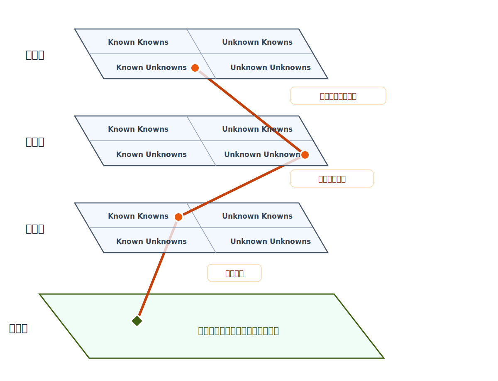

# 根源課題の地図

## 目的

コーディングエージェントへの委任で繰り返す失敗を、還元不能な5つの根源課題へ分類する。この文書は、介入先と評価方法を選ぶための最上位の判断地図である。

根本課題は、委任の4面にまたがる知識配置の不一致を、少ない検証労力で反証対象と衝突できる形へ外部化することである。

この文書には、根源課題、その関係、横断する洞察、判断に必要な根拠と代表例だけを置く。個別実装の工程、運用状態、長い機序説明は関連資料へ分離する。

## 用語

- **委任の4面**: 一つの事実・主張について、正否の照合先と、その把握・推論・評価を担う主体を区別するための4つの面。情報の種類ではなく、知識状態を比較する単位を表す。
  - **実態面**: 実在するコード、仕様、環境、挙動。実態面は照合先であり、知る主体ではない。
  - **意図面**: 依頼者が知り、意図し、暗黙に要求している内容。
  - **推論面**: モデルが把握、推論、仮定、補完している内容。
  - **評価面**: 消費者・検証者が知り、期待し、合否判定に使う内容。
- 主体面: 意図面、推論面、評価面の総称。残る3面は主体面として知識状態を持つ。
- 知識状態: ある事実・主張を主体面が知っているか、知らないことを把握しているかという状態。
- 知識配置図: 同じ事実・主張が各主体面でどの知識状態にあるかを示す図。
- 知識配置の不一致: 主体面どうし、または主体面と実態面の間で、同じ事実・主張の内容や知識状態が一致していないこと。
- 衝突: 成果物、主張、前提を、それらを反証できる実態または判断主体と突き合わせること。
- 衝突の予定: 衝突が回避不能な形で産出時または消費時に組み込まれていること。
- 無知の種類: 知識状態とは別に、把握していない内容を性質で分ける分類。
  - 命題的無知: 真偽を持つ事実・前提を把握していないこと。
  - 非命題的無知: 体験や提示を通さないと基準を認識できないこと。

## 知識配置図

ここでは、Known Knowns、Known Unknowns、Unknown Unknownsという分類にUnknown Knownを加えた4象限をRumsfeld Matrixと呼ぶ。

|                    | 自分の知識状態を把握している | 自分の知識状態を把握していない |
| ------------------ | ---------------------------- | ------------------------------ |
| 情報を持っている   | Known Known                  | Unknown Known                  |
| 情報を持っていない | Known Unknown                | Unknown Unknown                |

一点は事実・主張と主体面の組を表す。同じ主張でも、意図面ではKnown Known、推論面ではUnknown Unknown、評価面ではKnown Knownという配置がありうる。

実態面は4象限へ置かない。実態面は、その主張の真偽と、各主体面の配置が正しいかを照合する基準になる。

Rumsfeld Matrixは、主体が情報を持っているかと、その状態を把握しているかを表す。命題的無知と非命題的無知は、把握していない内容の種類を表すため、両者は別の分類軸になる。

## 委任の4面の層状図

3つの主体面を、実態と直接照合するまでに通る役割境界の順に重ねる。縦方向は役割境界、横方向は各主体面における知識状態を表す。



3つの主体面は同じ知識状態の座標系を持つが、面ごとに異なる知識配置を持ちうる。同じ事実・主張を結ぶ線の交点は、各面での知識状態を表す。

- 意図面―推論面: 依頼者の意図を表現し、モデルが解釈する境界。意図と解釈の不一致が知識配置の不一致として現れる。
- 推論面―評価面: モデルの推論を成果物や主張として外部化する境界。内部の推論と外部化された内容の不一致が現れる。
- 評価面―実態面: 評価基準を原本、環境、成果物、実際の挙動へ直接照合する境界。判断と実態の不一致が衝突によって露出する。

面の距離は、知識量や正確さを表さない。実態と直接照合するまでに通る役割境界を表す。同じ人やモデルが複数の面を担当してよく、モデルがテストを実行して結果を判定するときは評価面の役割も担う。

## 見取り図

- 深さ0: 根本課題
- 深さ1: 根本課題に対する役割
- 深さ2: 主要概念群
- 深さ3: 原理または分類
- 深さ4: キーワード、根拠、代表例

```text
根本課題: 委任の4面にまたがる知識配置の不一致を、少ない検証労力で反証対象と衝突できる形へ外部化すること
│
├─ 支配原理: P2 検証の非対称性
│  ├─ 委任の成立条件
│  │  └─ 製作より検証が安いこと
│  ├─ 中心仮説: 衝突の予定
│  │  ├─ 産出時の衝突: 作成中に実態との照合を避けられない
│  │  └─ 消費時の衝突: 反証手段を持つ主体へ必ず届く
│  ├─ 検証の独立性
│  │  ├─ 形式照合: 出典、引用、識別子
│  │  └─ 意味照合: 根拠が主張を本当に支持するか
│  └─ 介入評価の第1問
│     └─ いつ、何と、誰の判断に衝突するか
│
├─ 不可避制約: P1 意図伝達不能性 + P4 認識自己申告不能性
│  ├─ 委任の4面
│  │  ├─ 実態面: 正否の照合先
│  │  ├─ 意図面: 依頼者の目的と暗黙知
│  │  ├─ 推論面: モデルの推論と無音の補完
│  │  └─ 評価面: 消費者・検証者の合否条件
│  ├─ 知識配置図
│  │  ├─ Known Known / Known Unknown
│  │  └─ Unknown Known / Unknown Unknown
│  ├─ 無知の種類
│  │  ├─ 命題的無知: 真偽を持つ事実・前提を把握していないこと
│  │  └─ 非命題的無知: 体験や提示を通さないと基準を認識できないこと
│  ├─ 一貫性圧
│  │  └─ 未確認の前提を周囲と整合する値で無音に埋める
│  ├─ 問題設定の再定義
│  │  └─ 局所修正、経路選択の失敗、再発時に前提から疑う
│  └─ Unknown Unknownの発見
│     └─ 内観ではなく現実との衝突で一部をKnown Unknownへ移す
│
├─ 資源制約: P3 注意と文脈の希少性
│  ├─ 統治予算
│  │  └─ 規則と作業内容が同じ有限の注意を奪い合う
│  ├─ 文脈配置
│  │  └─ 必要な差を、必要な時点で、消費者に合う形で出す
│  ├─ 情報の追加と除去
│  │  └─ 積めるが取り除けない構造は検証能力を侵食する
│  └─ 人間の注意予算
│     └─ 全読ではなく抜き取り照合と信頼配分に使う
│
├─ 蓄積と複利: P5 蓄積の不在
│  ├─ 衝突の複利化
│  │  └─ 一度の高価な反証を次回の安い検証へ変える
│  ├─ 忠実度の還流
│  │  └─ 高価な現実接触で安い検証手段を較正する
│  └─ 学びの外部化
│     └─ 失敗を再利用可能な知識と検証手段へ変える
│
├─ 会計と停止規則
│  ├─ 失敗事例の根源課題分類
│  │  └─ P1〜P5を主因から副因の順に記録する
│  ├─ 失敗記録の捕捉偏り
│  │  └─ 検証が難しい失敗ほど発見・記録されにくい
│  └─ 分類自体がP4の制約を受ける
│     └─ 観測分布だけで改善余地の枯渇を断定しない
│
└─ 横断条件: 消費者文脈と伝播経路
   ├─ 消費者文脈の原理
   │  └─ 検証者の文脈を成果物の実利用者へ合わせる
   └─ 要約連鎖とフレーム汚染
      └─ 一次資料との接続を保ち、要約を正本にしない
```

## 5つの根源課題

| 課題                    | 核                                                               | 管理の境界                                                                           |
| ----------------------- | ---------------------------------------------------------------- | ------------------------------------------------------------------------------------ |
| P1 意図の伝達不能性     | 意図は依頼者の内部にあり、言語だけでは完全に伝わらない。         | 完全な仕様を目指さず、補完した前提を可視化し、判断が必要な部分を相互作用で確かめる。 |
| P2 検証の非対称性       | 検証労力が製作労力に近づくと、委任の利点が消える。               | 成果物を増やす前に、正否を少ない労力で判定できるかを問う。                           |
| P3 注意と文脈の希少性   | 規則と作業内容は、同じ有限の注意予算を奪い合う。                 | 情報量ではなく配置を管理し、不要になった情報を除く。                                 |
| P4 認識の自己申告不能性 | モデルは、知識ともっともらしい補完の境界を安定して申告できない。 | 自己申告だけを根拠にせず、実態面または判断主体との照合可能性を残す。                 |
| P5 蓄積の不在           | セッション内の経験は、そのままでは次の作業へ残らない。           | 失敗から得た反証を、再利用可能な知識と検証手段へ変える。                             |

P1とP4は解消できず、無知を自覚しているかどうかとは別に、命題的無知と非命題的無知が残りうる。P3とP5は工学的に管理でき、P2が全体の管理労力を支配する。

## 中心洞察

- P2は支配原理である: 委任は製作より検証が安いときに成立する。他の根源課題への介入も、最終的には検証労力を下げられるかで価値が決まる。
- P1とP4では二種類の無知が残る: 命題的無知は原本、調査、計測、実行結果によって確かめられる。非命題的無知は、体験や提示に対する判断主体の反応を通して初めて認識できる。
- 一貫性圧は未知を静かに埋める: モデルは未確認の前提を空白に保つより、周囲と整合する値で補完しやすい。補完後の全体が整うほど、誤った前提は局所的な違和感として現れにくい。
- 衝突の予定は設計仮説である: 未知と誤りを外へ露出させるには反証対象との衝突が要る。ただし、回避不能な衝突を持つ成果物だけが品質装置として機能するという主張は、限定された観測に支えられた仮説である。
- 独立性は枚数より相関で決まる: 同じ前提、文脈、見方を共有する検証者は同じ誤りを見逃しやすい。検証では、成果物を実際に使う側の文脈へ合わせ、見逃しの原因を共有しない経路を選ぶ。
- 衝突は記録されて初めて複利になる: 高価な失敗を経験しても、次回の安い検証へ変換されなければ同じ費用を再び払う。右端の高価な現実接触は削減対象であると同時に、安い検証手段へ忠実度を戻す較正源でもある。
- 要約は正本ではない: 要約の連鎖は、前段の誤ったフレームを後段へ自信ありげに渡す。一次資料への接続と、要約を見ない主体による再構成が必要になる。

## 根拠と代表例

根拠は、理論的な支持、観測事例、固定条件下の測定に分けて示す。どの行も、右端に書いた範囲を越える一般化を証明しない。

| 根拠の種類 | 出典または安定識別子                           | 支持する主張                                                     | 証明しない範囲                                                                          |
| ---------- | ---------------------------------------------- | ---------------------------------------------------------------- | --------------------------------------------------------------------------------------- |
| 理論的根拠 | Grossman & Hart, 1986                          | 契約に未規定の事項が残るというP1の類似構造                       | 個々の依頼者の意図が常に取得不能であること                                              |
| 理論的根拠 | Kadavath et al., 2022                          | 限定された課題ではモデルの自己較正を測定できること               | 長い委任工程で自己申告が安定して機能すること                                            |
| 理論的根拠 | Knight & Leveson, 1986                         | 独立に作られた検証系でも失敗が相関しうること                     | モデルによる検証の相関率や具体的な低減効果                                              |
| 理論的根拠 | Spence, 1973 / Goodhart, 1975                  | 偽装コストと指標の目標化を考えるための理論的類似                 | 衝突の予定がこのリポジトリで有効であること                                              |
| 観測事例   | 2026-06-25 readiness null / baseline `02229fd` | 3シナリオでは自己申告層の追加が移行率を改善しなかった            | 自己申告を含む全ての確認手段が無効であること                                            |
| 観測事例   | `20260628-1706` 識別子スコープ取り違え         | 原本の行構造を確認せず一般論を適用し、複数の検証者も見逃した     | 全ての複数検証が無効であること                                                          |
| 観測事例   | `20260712-1713` review doom loop               | 記録形式の追加だけでは、検証なしの全件受理と不収束を止めなかった | 工程構造の変更だけで収束を保証できること                                                |
| 測定結果   | `W6-RERUN-2`                                   | 固定した合成scenarioで制御率25%→83.3%、契約逸脱13→0を測定した    | 部品ごとの寄与、本番効果、採用可否。hold-outでは独立確認の完遂にcritical失敗4件が残った |

## 介入を評価する問い

- 見取り図のどの枝に対応するか。
- どの事実・主張について、どの面の知識配置が一致していないか。
- 把握していない内容は、命題的無知か、非命題的無知か。
- 成果物は、いつ、何と、誰の判断に衝突するか。
- 製作労力を増やすだけでなく、検証労力を下げるか。
- 必要な情報は、検証者の注意を壊さない場所と量になっているか。
- 得られた反証を次の安い検証へ再利用できるか。
- どの観測が介入の失敗を示し、いつ撤回するか。

## 限界と関連資料

P1〜P5は診断軸であり、個々の失敗を一意に説明する真理値ではない。根源課題の分類自体もP4の制約を受ける。

失敗記録は、実際に起きた全失敗ではなく、人間または検証手段が発見して記録できた標本である。検証が難しい失敗ほど捕捉されにくいため、記録上の分布だけから改善余地の枯渇を断定できない。

この文書が固定するのは問題構造と設計仮説であり、個別介入の有効性ではない。介入の価値は、介入ごとの外部観測で別に確かめる。

- P1の意図抽出: [`fundamental-problem-analysis/intent-elicitation-discipline.md`](fundamental-problem-analysis/intent-elicitation-discipline.md)
- P2の信頼崩壊と監査問題: [`fundamental-problem-analysis/trust-collapse.md`](fundamental-problem-analysis/trust-collapse.md)
- P2/P4の根拠収集: [`fundamental-problem-analysis/evidence-retrieval.md`](fundamental-problem-analysis/evidence-retrieval.md)
- P3の文脈管理: [`fundamental-problem-analysis/context-management.md`](fundamental-problem-analysis/context-management.md)
- 規則の減価確認: [`sunset-ablation-procedure.md`](sunset-ablation-procedure.md)
- Knowns / Unknownsの管理例: [`fundamental-problem-analysis/corpus/a-field-guide-to-fable.md`](fundamental-problem-analysis/corpus/a-field-guide-to-fable.md)

## 出典

- Grossman, S. J. & Hart, O. D., “The Costs and Benefits of Ownership: A Theory of Vertical and Lateral Integration,” 1986. <https://doi.org/10.1086/261404>
- Kadavath, S. et al., “Language Models (Mostly) Know What They Know,” 2022. <https://arxiv.org/abs/2207.05221>
- Knight, J. C. & Leveson, N. G., “An Experimental Evaluation of the Assumption of Independence in Multiversion Programming,” 1986. <https://doi.org/10.1109/TSE.1986.6312924>
- Spence, M., “Job Market Signaling,” 1973. <https://doi.org/10.2307/1882010>
- Goodhart, C. A. E., “Problems of Monetary Management: The U.K. Experience,” 1975.
- Rumsfeld, D., “Known and Unknown: Author’s Note.” <https://papers.rumsfeld.com/about/page/authors-note>
